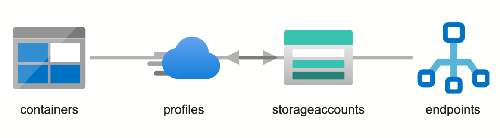
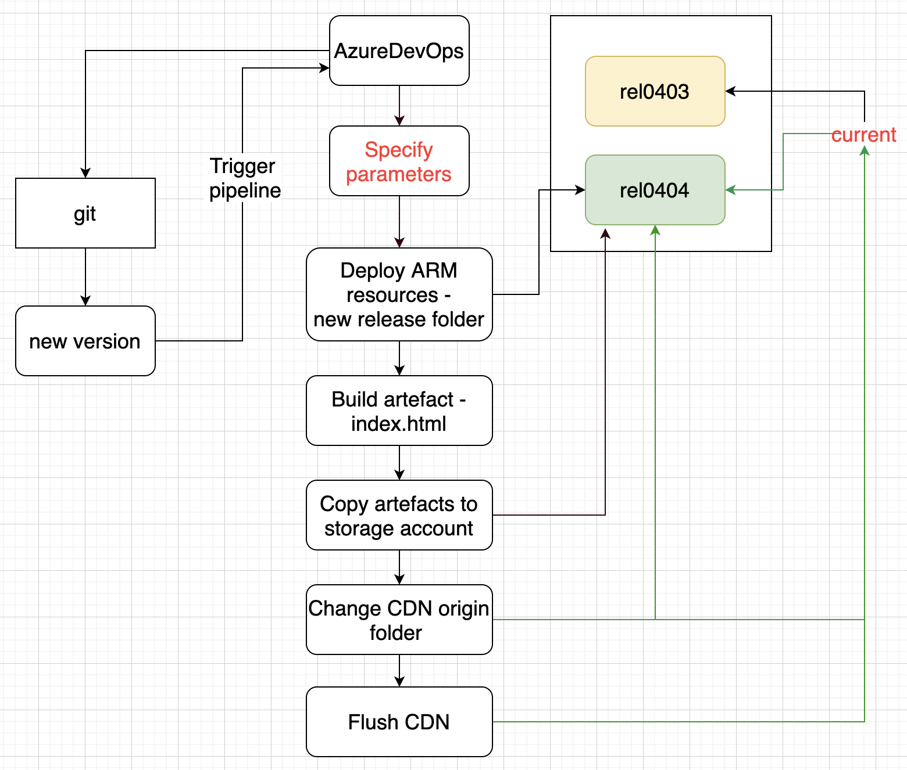
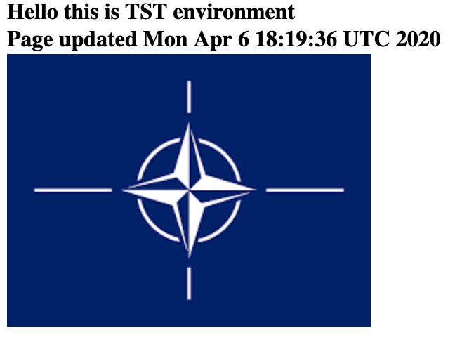

## Introduction 

This sample continous deployment experience leverages Azure DevOps for deploying simple static website based artefacts utilizing CDN for static content serving. 

## Azure solution elements

## Azure DevOps pipeline 

Continous deployment is implemented storing every new release artefacts in a new blob container and changing CDN origin path to that specific container. Thus you can easily shuffle the release version you want to introduce to your end users without cumbersome procedures.

## Setup

1. Create Azure DevOps project.
2. Place contents of this directory into your git of choice.
3. Create new pipeline project and link it into git.
4. Change azureResourceManagerConnection and azureSubscription in azure-pipelines.yml to link to your subscription.
5. Run the pipeline by specifying parameters of your selection.
6. Navigate to your CDN endpoint (https://cdn.azureedge.net/index.html) Should be getting page contents similar to:

7. That's it. Good luck in your production scenarios!

